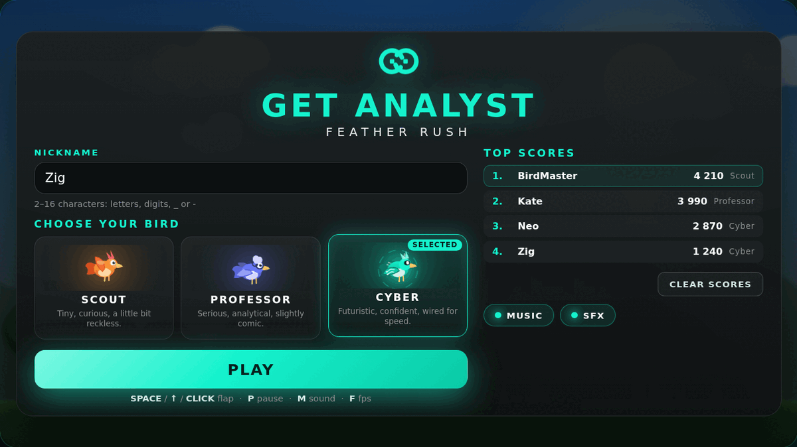
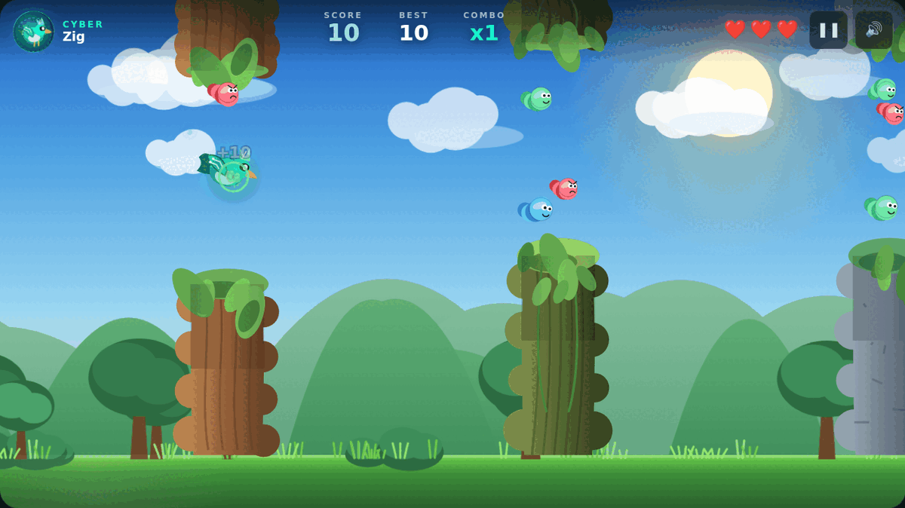
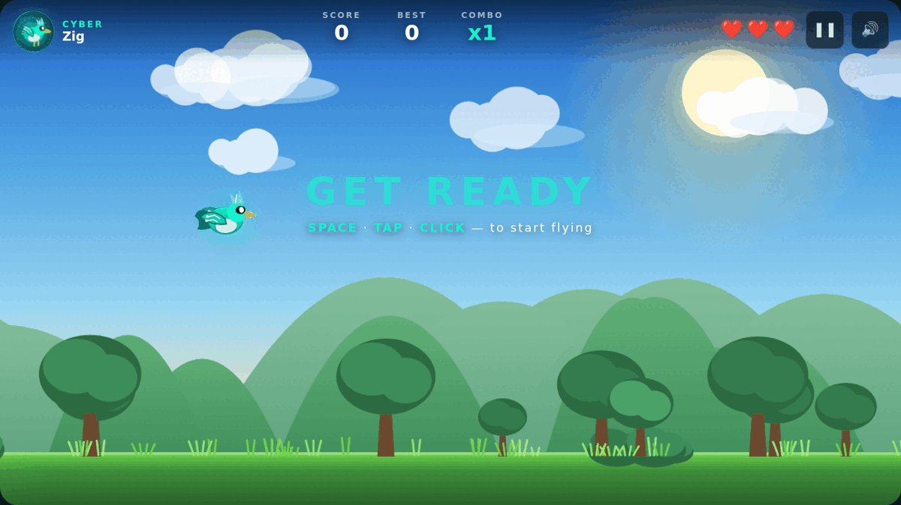
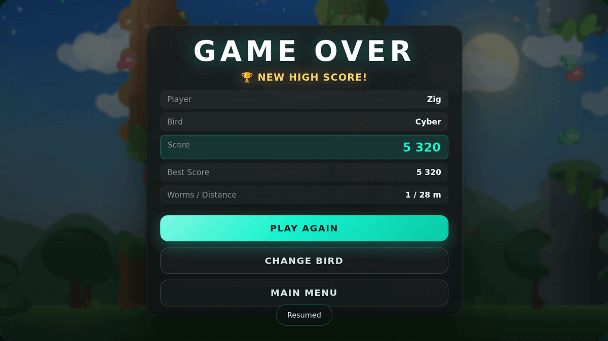

# Get Analyst: Feather Rush

Брендированная браузерная мини-игра для **Get Analyst**: птичка летит через бесконечный
летний уровень, проходит проходы между скалами, брёвнами и лианами, собирает червячков,
держит комбо и бьёт локальные рекорды.









## Быстрый старт

Backend не нужен, зависимостей нет.

```bash
# вариант 1 — просто открыть файл
xdg-open index.html          # или перетащить index.html в браузер

# вариант 2 — локальный сервер
python3 -m http.server 8080  # затем http://localhost:8080
```

Оба варианта проверены в headless Chromium: игра, звук и `localStorage` работают и по
`file://`, и по `http://`.

## Управление

| Действие | Клавиши |
| --- | --- |
| Взлёт (flap) | `Space`, `↑`, `W`, клик мышью, tap на мобильном |
| Пауза / продолжить | `P`, `Esc`, кнопка ❚❚ в HUD |
| Звук вкл/выкл | `M`, кнопка 🔊 в HUD |
| Счётчик FPS и частиц | `F` |
| Старт из поля nickname | `Enter` |

Потеря фокуса окна или скрытие вкладки автоматически ставит игру на паузу.

## Как играть

1. Ввести nickname (2–16 символов: буквы, цифры, `_`, `-`; поддерживаются кириллица и Unicode-буквы).
2. Выбрать одну из трёх птичек.
3. Нажать **PLAY** — игра переходит в состояние готовности: птичка парит на месте,
   уровень не движется, на экране горит `GET READY`.
4. Первое нажатие (`Space` / tap / клик) запускает полёт. Так игрок начинает игру
   в тот момент, когда сам готов, а не падает сразу после нажатия PLAY.

Птичка автоматически летит вперёд, игрок управляет только высотой. Три жизни, ~1.3 с
неуязвимости после столкновения (птичка мигает). После третьего попадания — **GAME OVER**.

### Червячки

| Червячок | SCORE | Редкость | Особенность |
| --- | --- | --- | --- |
| 🟢 Green | +10 | частый | — |
| 🔵 Blue | +25 | средний | — |
| 🟣 Purple | +50 | редкий | — |
| 🟡 Golden | +100 | очень редкий | glow, sparkle, отдельный бонус-звук |
| 🔴 Red | −25 | нечастый | ломает комбо, жизнь не отнимает, SCORE не уходит ниже 0 |

Проход между препятствиями даёт **+10**.

### Комбо

| Червячков подряд | Множитель |
| --- | --- |
| 3 | x2 |
| 6 | x3 |
| 10 | x4 |

Множитель применяется к SCORE за полезных червячков. Красный червячок или столкновение
сбрасывают комбо. На экране появляется `COMBO x2!`, `COMBO x3!`, `COMBO x4!`.

### Сложность

Шесть уровней сложности, привязанных к SCORE (0 / 150 / 400 / 800 / 1400 / 2200), значения
интерполируются плавно, без скачков: скорость растёт 265 → 520 px/s, проход сужается
302 → 212 px, интервал между препятствиями падает 1.75 → 1.14 с, меняется рисунок уровня.
Генерация гарантирует проходимость: минимальный проход 200 px, вертикальное смещение
соседних проходов ограничено физикой полёта, а автопилот-тест пролетает все стадии без
единого столкновения.

## Персонажи

| Персонаж | Характер | Внешний вид |
| --- | --- | --- |
| **SCOUT** | любопытный, дерзкий | компактная оранжевая птичка, красный хохолок, быстрый взмах |
| **PROFESSOR** | серьёзный, аналитичный, слегка комичный | сине-фиолетовая птичка в круглых очках, спокойная анимация |
| **CYBER** | футуристичный, уверенный | бирюзовая птичка со светящимся визором, геометрическим крылом и trail-эффектом |

Все три птички имеют **одинаковую механику**: тот же импульс взлёта, та же гравитация, тот
же hitbox (радиус 17 px), те же очки и жизни. Отличаются только спрайт, ритм взмаха и
косметические эффекты — лидерборд остаётся честным. Это закреплено автотестом
(`every character shares exactly the same flight model and hitbox`).

Анимации: idle-парение в меню, flap с наклоном вверх при взлёте, наклон вниз при падении,
короткая реакция на столкновение (вспышка + рывок), мерцание в период неуязвимости.
У Cyber при взлёте остаётся короткий светящийся след.

## Брендинг и дизайн-система

Палитра и типографика взяты из фирменного стиля GetAnalyst (логотип и сайт getanalyst.ru):

| Токен | Значение | Назначение |
| --- | --- | --- |
| `--ga-accent` | `#16F3CE` | фирменный бирюзовый акцент, CTA, SCORE, heart-статусы |
| `--ga-accent-2` / `--ga-accent-3` | `#0ACAA6` / `#08A285` | градиенты и тени |
| `--ga-bg` / `--ga-surface-2` | `#0B0E0F` / `#1C1C1C` | тёмные поверхности интерфейса |
| `--ga-text` / `--ga-muted` | `#FFFFFF` / `#8E8E8E` | контрастный и вторичный текст |
| `--ga-danger` / `--ga-gold` | `#FF5C7A` / `#FFD166` | опасность и рекорд |

Шрифт — Montserrat с системным fallback. Знак бренда (две дуги + два квадрата) воссоздан
векторно в SVG, wordmark `GET ANALYST` набран фирменным акцентом со свечением.

Мир игры — яркая мультяшная аркада (летнее небо, солнце, облака, холмы, деревья,
параллакс в 5 слоёв), интерфейс — тёмная технологичная стилистика Get Analyst. Размеры
всего UI считаются от переменной `--u` (1% ширины сцены), поэтому интерфейс
масштабируется вместе с canvas без искажения пропорций 16:9.

## Архитектура

```
/
├── index.html            # разметка всех экранов + подключение модулей
├── styles.css            # дизайн-система Get Analyst, адаптив, анимации UI
├── js/
│   ├── utils.js          # математика, RNG, валидация nickname, эмиттер
│   ├── config.js         # палитра, физика, персонажи, червячки, стадии сложности
│   ├── storage.js        # StorageManager: localStorage + безопасный fallback
│   ├── score.js          # ScoreManager: очки, комбо, статистика, difficulty
│   ├── particles.js      # ParticleSystem: burst, ring, sparkle, confetti, trail, текст
│   ├── background.js     # ParallaxBackground: небо, солнце, облака, холмы, зелень
│   ├── bird.js           # Bird + отрисовка трёх персонажей, физика, анимации
│   ├── worm.js           # Worm/WormManager: 5 типов, редкость, спавн в проходах
│   ├── obstacle.js       # ObstaclePair/Manager: генерация проходов и структуры
│   ├── audio.js          # AudioManager: MasterGain/MusicGain/SfxGain, SFX, музыка
│   ├── input.js          # InputManager: клавиатура, мышь, touch, blur
│   ├── bird-selector.js  # BirdSelector: карточки персонажей и их preview
│   ├── ui.js             # UIManager: экраны, HUD, лидерборд, модалки, тосты
│   └── game.js           # Game: состояния, игровой цикл (delta time), коллизии, рендер
├── tests/
│   ├── unit.test.js      # 48 логических тестов (Node, без зависимостей)
│   ├── browser.test.js   # 150 интеграционных проверок в headless Chromium (CDP)
│   ├── browser.html      # сценарий этих проверок
│   ├── perf.js           # замер кадрового времени по слоям сценария
│   └── screenshots.js    # генерация скриншотов
├── docs/                 # скриншоты для README
└── package.json          # только npm-скрипты, без зависимостей
```

Модули оформлены как UMD-совместимые: в браузере подключаются обычными `<script>` и
живут в пространстве `GA` (работает и по `file://`), в Node — через `require()` для тестов.

Ключевые технические решения:

* **Игровой цикл** — `requestAnimationFrame` с delta time, шаг ограничен 50 мс, вся физика
  и тайминги в секундах, поэтому игра не зависит от FPS (проверено тестом на двух разных
  размерах шага).
* **Состояния** — `MENU`, `CHARACTER_SELECT`, `PLAYING`, `PAUSED`, `GAME_OVER`.
* **Звук** — один `AudioContext`, три gain-канала (`MasterGain`, `MusicGain`, `SfxGain`).
  Все SFX синтезируются осцилляторами и шумом; взмах крыла — это короткий «пук»
  маленького существа (две расстроенные пилообразные волны через падающий lowpass,
  квадратный LFO по громкости и очень короткая огибающая 90–140 мс, высота и длина
  рандомизируются на каждый взмах). Музыка — процедурная (прогрессия Am–F–C–G, бас,
  арпеджио, перкуссия), но рендерится заранее в два зацикленных буфера и играет двумя
  источниками: громкость «плотного» варианта растёт вместе со сложностью, темп слегка
  ускоряется.
  `AudioContext` создаётся только после жеста пользователя (autoplay policy), при
  недоступности Web Audio игра продолжает работать без звука.
* **Хранилище** — `localStorage` с префиксом `ga.featherrush.v1.`: nickname, выбранная
  птичка, TOP-10 (хранится до 50 записей: nickname, score, bird, date, worms), настройки
  звука, счётчик игр. Битые данные, отключённое хранилище и private mode не ломают игру —
  используется in-memory fallback.

## Производительность

Кадровое время измеряется отдельным инструментом (`node tests/perf.js`), который
принудительно растрирует каждый кадр (`getImageData`), наполняет сцену препятствиями,
червячками и частицами и сравнивает стоимость по слоям. Именно эти замеры определили
оптимизации:

| Что было узким местом | Что сделано |
| --- | --- |
| `ctx.shadowBlur` на каждом сегменте каждого червячка и на каждой частице | заменён на заранее испечённые спрайты свечения (`drawImage`), у текстовых всплывашек размытие убрано совсем |
| Перерисовка ~2.8 млн пикселей фона за кадр: градиенты неба, солнца, холмов, деревьев создавались заново каждый кадр | каждый слой фона испечён один раз в offscreen-canvas; небо + солнце + дальние холмы блитятся одним непрозрачным `copy`-проходом, который заодно заменяет `clearRect`; движутся только три слоя (облака, ближние холмы, зелень) |
| Градиенты и `RNG` препятствий внутри кадра, двойная заливка теней на всю высоту колонны | градиенты кэшированы по стилю, бугры предвычислены при создании, тень рисуется полосой у прохода |
| Аллокации в горячем пути (прямоугольники коллизий, `{spawned,passed}`, объекты сложности, массивы сбора червячков) — источник периодических пауз GC | коллизии считаются без объектов, результаты переиспользуются, цели сложности пересчитываются 5 раз в секунду |
| Планировщик музыки создавал ~46 Web Audio-узлов в секунду с пиками до 2.3 мс на главном потоке | музыка рендерится заранее в два зацикленных буфера (`OfflineAudioContext`) и играет двумя источниками с кроссфейдом по сложности — 0 узлов в секунду во время игры; живой планировщик остался только как fallback |
| Canvas в HiDPI раздувался до ~4 млн пикселей | бюджет бэк-стора 1.6 млн пикселей: разрешение адаптивно снижается, картинка не искажается |
| Полный ре-рендер во время паузы | на паузе кадр не перерисовывается вообще |

Итог на тестовом стенде (headless Chromium, программный растеризатор — то есть
худший случай): кадр геймплея **11.4 → 8.9 мс**, фон **7.8 → 5.7 мс**, препятствия
**3.0 → 2.7 мс**, музыка **45.6 → 0** создаваемых узлов в секунду. Плюс `F` в игре
показывает живой FPS, число частиц, червячков и препятствий.

## Тесты

```bash
node tests/unit.test.js       # 48 тестов логики: утилиты, storage, счёт, комбо,
                              # червячки, генерация препятствий, физика, баланс персонажей
node tests/browser.test.js    # 150 проверок в реальном headless Chromium через CDP
node tests/perf.js            # кадровое время по слоям + бюджет кадра
node tests/screenshots.js     # скриншоты в /tmp для визуальной проверки
```

`tests/browser.test.js` поднимает локальный сервер, запускает Chromium, водит игру
детерминированными шагами и проверяет: загрузку и брендинг меню, валидацию nickname,
выбор и сохранение птички, старт, flap/физику/границы, проход препятствия (+10),
столкновение и жизни, неуязвимость, сбор всех типов червячков, комбо, «пол» очков,
рост сложности, паузу и авто-паузу, game over, confetti и new high score, сохранение в
`localStorage`, PLAY AGAIN, CHANGE BIRD, MAIN MENU, лидерборд после перезагрузки страницы,
CLEAR SCORES с подтверждением, звук и mute, адаптив, а также отсутствие JS-ошибок и
падений. Дополнительно проверяются: ожидание первого взмаха (READY), бюджет кадра,
предрендер музыкального лупа с замером реального сигнала через `AnalyserNode` и
синтез звука взмаха через `OfflineAudioContext` (пик, длительность, отсутствие ошибок).
Переменные окружения: `CHROME` (путь к браузеру), `CDP_PORT`, `FRAME_BUDGET_MS`.

## Ограничения

* Backend отсутствует: лидерборд локальный, рекорды видны только в этом браузере.
* Музыка и звуки синтезируются на лету — это осознанный выбор вместо внешних ассетов
  (нет copyrighted-контента и лишних файлов), поэтому звук не «студийный».
* Точных брендовых ассетов в репозитории не было: палитра, шрифт и знак бренда
  воссозданы по публичному фирменному стилю getanalyst.ru.
* Игра рассчитана на клавиатуру/тап; геймпад не поддерживается.
* Скриншоты в `docs/` сняты автоматически (`tests/screenshots.js`).

## Лицензия

Не определена.
